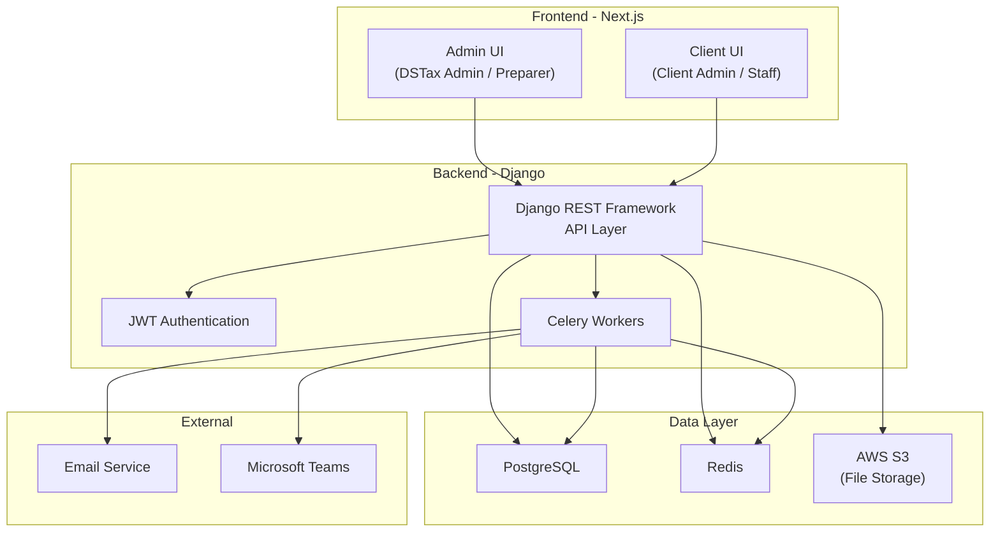

# DSTax Compliance - Project Overview

## 1. Introduction

DSTax Compliance is a web application that helps DSTax employees manage and prepare tax compliance for business clients. The system supports manual workflows from tax calculation and tax report generation to automated email notifications.

> [!NOTE]
> This is a separate project, not directly related to the current DSTax Portal, but belongs to the same DSTax ecosystem and shares the design system (colors, shapes...) on the frontend.

---

## 2. Glossary

| Term | Description |
|---|---|
| **DSTax** | The company providing compliance services (direct client of the dev team) |
| **Client** | The business entity using DSTax services |
| **Legal Entity (LE)** | A legal entity under a Client (subsidiary, branch...). A Client has multiple LEs |
| **DSTax Admin (DA)** | Senior DSTax employee, highest permission in the system (not a superuser) |
| **DSTax Preparer (DP)** | DSTax employee who directly edits reports for Clients |
| **Client Admin (CA)** | Client-side admin, highest permission for the corresponding Client |
| **Client Staff (CS)** | Client-side employee, only views reports of assigned LEs |
| **TVR** | Tax Valuation Report - Monthly tax assessment report |
| **Jurisdiction** | Legal jurisdiction area (Country, State, Local) |
| **Filing Frequency** | Frequency of tax filing (Monthly, Quarterly, Annual...) |
| **Filing Type** | Tax filing method (EFILE, Mail) |

---

## 3. Tech Stack

### Backend
- **Python 3.14** (Testing: pytest)
- **Django** + Django REST Framework
- DRF Spectacular (API docs), Django Filters, Django Debug Toolbar
- Django REST Framework Simple JWT (Auth)
- **Celery** (Background tasks)
- **PostgreSQL** (Database)
- **Redis** (Cache / Message broker)
- **AWS** (S3, EC2...)

### Frontend
- **React / Next.js**
- **Tailwind CSS**
- Shared styles with DSTax Portal (colors, shapes...)

---

## 4. Phase Breakdown

### Phase 1 (Core)
- ✅ Authentication (Login, Logout, Forgot/Reset/Change Password, Update Profile)
- ✅ Master Data management (Jurisdictions, Filing Frequency, Filing Type, Tax Type, Prepayment Method)
- ✅ Client & Legal Entity management
- ✅ User management
- ✅ TVR (Tax Valuation Report) - Core workflow
- ✅ Workflow notifications (Email/Teams)
- ✅ EFILE Credentials management
- ✅ Credit Carryforwards

### Phase 2 (Extended)
- ⬜ Client Folders (Google Drive-like file management)
  - Inbound Data, Outbound Data, Archived Returns, Client Documents
  - Upload, download, drag & drop, folder organization
- ⬜ Support Tickets
- ⬜ Communications (Email to clients/groups)
- ⬜ Other auxiliary functions

---

## 5. Roles & Permissions Overview

| Function | DSTax Admin | DSTax Preparer | Client Admin | Client Staff |
|---|:---:|:---:|:---:|:---:|
| Master Data (CRUD) | ✅ | ❌ | ❌ | ❌ |
| Client/LE management | ✅ | ❌ | ❌ | ❌ |
| User management | ✅ | ❌ | ❌ | ❌ |
| TVR - View all | ✅ | ❌ | ✅ (own Client) | Assigned LEs |
| TVR - Edit | ✅ | Assigned LEs | ❌ | ❌ |
| Workflow - PREPARED | ✅ | ✅ | ❌ | ❌ |
| Workflow - REVIEW COMMENTS | ✅ | ❌ | ❌ | ❌ |
| Workflow - PUBLISH RETURNS | ✅ | ❌ | ❌ | ❌ |
| Workflow - FUNDING RECEIVED | ✅ | ❌ | ❌ | ❌ |
| EFILE Credentials | ✅ | Assigned Clients | ❌ | ❌ |
| Credit Carryforwards | ✅ | Assigned Clients | ❌ | ❌ |
| Communications | ✅ | ❌ | ❌ | ❌ |

---

## 6. High-level Architecture

