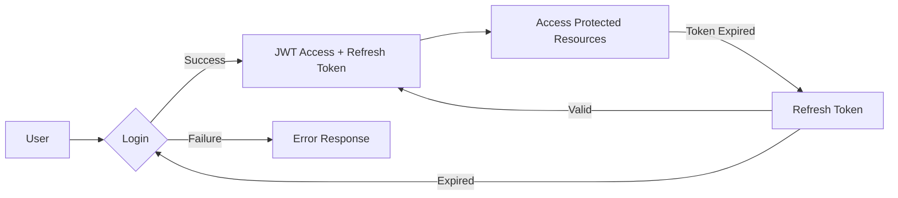
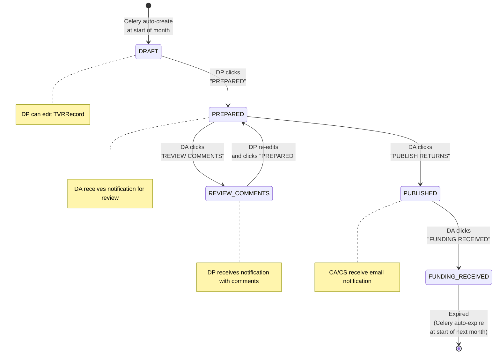
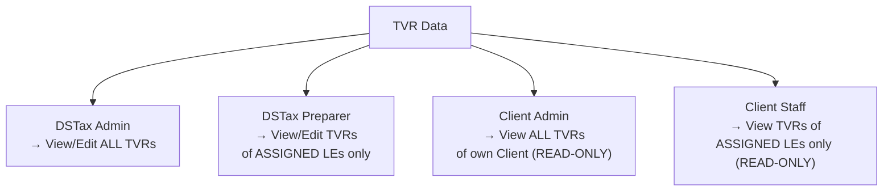
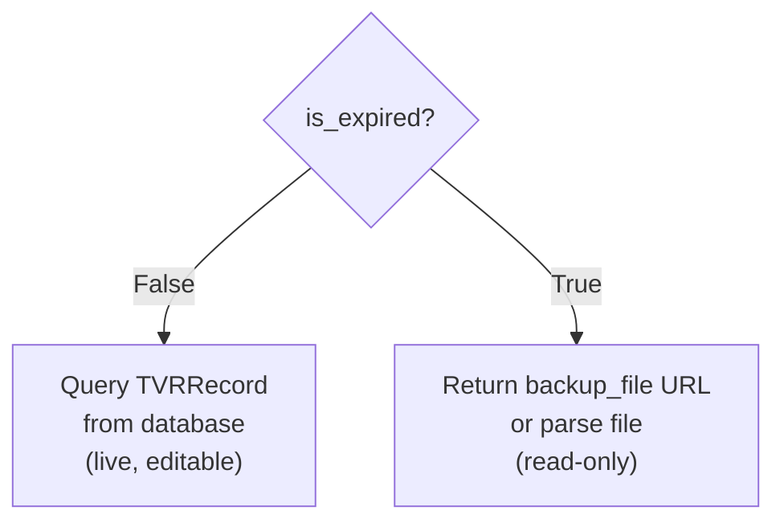
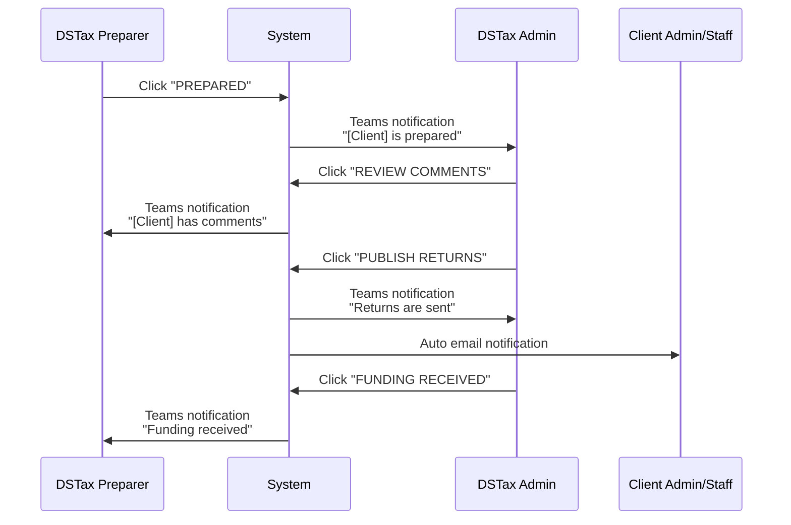

# DSTax Compliance - Business Logic & Workflows

## 1. Authentication Flow



**Auth Functions:**
- Login / Logout
- Forgot Password → Send reset email → Reset Password
- Change Password (authenticated)
- Update Profile

---

## 2. Master Data Management

Master Data are lookup tables managed by the DSTax Admin. This data is used for creating and managing TVRs.

### Master Data List

| Table | Example Data | Managed by |
|---|---|---|
| **JurisdictionLevel** | Country, State, Local | DSTax Admin |
| **Jurisdiction** | UT (State), CO-Denver (Local) | DSTax Admin |
| **FilingFrequency** | M, M/Q, Q, oQ, SA, A, A1-A12, Occasional | DSTax Admin |
| **FilingType** | EFILE, Mail | DSTax Admin |
| **TaxType** | Sales, Sellers Use, Consumer's Use, Combined, CAT | DSTax Admin |
| **PrepaymentMethod** | FL→Fixed, OK→50% of same month prior year, OH→75% of current month, NY→PromptTax | DSTax Admin |

### Jurisdiction Detail

Each Jurisdiction has:
- **Name**: name of the area (e.g., UT, CO-Denver)
- **Level**: FK to JurisdictionLevel (Country/State/Local)
- **Due Date/Time**: filing deadline (e.g., "End of Month"/"End of Day", "20th"/"4pm Central")

> [!IMPORTANT]
> `PrepaymentMethod` is mapped 1-1 with a State Jurisdiction. Each State has only 1 prepayment method.

---

## 3. TVR (Tax Valuation Report) - Core Workflow

TVR is the core functionality of the system. Every month, the system automatically creates a TVR period for each Client.

### 3.1. TVR Period Lifecycle



### 3.2. TVR Workflow Step-by-step

```
Step 1: [AUTO] Celery task automatically creates a new TVRPeriod for each Client at the beginning of each month
         → Simultaneously expires the old month's TVRPeriod (is_expired = True)
         → Backs up the old month's data into a CSV/Excel file saved in backup_file
         → Deletes the old month's TVRRecords (data is only kept in DB for the current month)

Step 2: [MANUAL] DP edits the TVRRecords within the TVRPeriod
         → Only certain columns are editable (highlighted yellow in Excel)
         → Each record corresponds to one row on the TVR screen/Excel

Step 3: [MANUAL] DP clicks "PREPARED" button
         → Status: DRAFT → PREPARED
         → Teams notification to DA: "[Client Name] is prepared"

Step 4: [MANUAL] DA reviews and adds comments
         → DA can click "REVIEW COMMENTS"
         → Status: PREPARED → REVIEW_COMMENTS
         → Teams notification to DP: "[Client Name] has comments to review"

Step 5: [MANUAL] DP views comments, edits, and clicks "PREPARED" again
         → The review loop can repeat multiple times

Step 6: [MANUAL] DA clicks "PUBLISH RETURNS"
         → Status: PREPARED → PUBLISHED
         → Teams notification to DA: "Returns are sent"
         → Auto email to Client (CA/CS)

Step 7: [MANUAL] DA clicks "FUNDING RECEIVED"
         → Status: PUBLISHED → FUNDING_RECEIVED
         → Teams notification to DP: "Funding is received"
```

### 3.3. TVR Data Access Control



### 3.4. TVR Record - Data Structure of a row

Each TVRRecord represents **1 row** on Excel/screen, containing:

| Group | Columns |
|---|---|
| **Reference** | Legal Entity, Jurisdiction, Tax Type, Filing Frequency, Filing Method |
| **Financial** | GL Amount, Sales Tax Extract, Amount to Adjust, Manual Adjustment, Use Tax |
| **NMR Carry** | NMR CF Prior, NMR CF Future |
| **Credits** | Credits CF Prior, Credits CF Future |
| **Adjustments** | Local Adjustment, Gross Due, Prepayment Credit, Prepayment Due |
| **Discounts/Tax** | Vendor's Discount, B&O Tax, Rounding, Currency Converted |
| **Settlement** | Net Due, Currency Code, Amount to Fund |
| **Confirmation** | Status/Conf Num, Payment Conf Num, Payment Amount |
| **Dates** | Filing Date, Payment Date |
| **Comments** | Client Comment, DSTax Comment |

### 3.5. TVR Expired Data Strategy



> [!WARNING]
> When a TVRPeriod expires, all related TVRRecords are **DELETED** from the DB. Data remains only in the backup file (CSV/Excel). The `get_records()` logic will handle reading from the file if `is_expired=True`.

---

## 4. Credit Carryforward

Credit Carryforward tracks credit balances carried over periods:

```
Prior Balance → (+/- Current Period) → Ending Balance
```

This table is **NOT** deleted monthly like TVRRecord; it is stored permanently with a `period_date` field to track history.

---

## 5. EFILE Credentials

Stores login information for e-filing tax portals of each Jurisdiction for each Legal Entity. Includes:
- Channel/Parent Company → Legal Entity → State/Jurisdiction
- Return Form, Account Number, Local ID
- URL, Username, Password, PIN
- Security Questions & Answers
- 2nd User Credentials

> [!CAUTION]
> This is **sensitive** data (credentials). Must implement encryption at rest and strict access control. Only DSTax Admin sees everything; DPs only see assigned Clients.

---

## 6. Notification System


