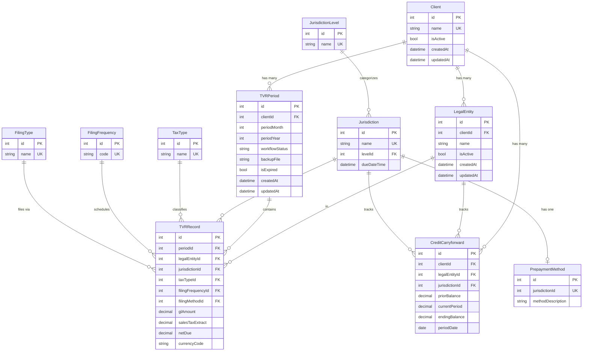

# DSTax Compliance - Database Schema Review

## 1. Entity Relationship Diagram



---

## 2. Current DB Design Review

### ✅ Strengths

1. **Good Master Data Normalization**: Lookup tables (JurisdictionLevel, FilingFrequency, FilingType, TaxType) are separated, avoiding data duplication.

2. **Reasonable On Delete Strategy**:
   - `CASCADE` for Client → LegalEntity, TVRPeriod (deleting a client deletes all related data)
   - `PROTECT` for Jurisdiction, TaxType, FilingFrequency, FilingType (prevents deletion if currently in use)

3. **Separate CreditCarryforward**: Correctly prevents CreditCarryforward from being deleted monthly like TVRRecord.

4. **1-1 PrepaymentMethod with Jurisdiction**: Clear mapping, each state has only one prepayment method.

### ⚠️ Considerations / Improvements

#### 2.1. Jurisdiction.due_date_time using DateTimeField

**Issue**: `due_date_time` is described as "End of Month", "20th", "4pm Central" - these are NOT specific datetime values but **recurring rules**.

**Suggestion**: Split into 2 or 3 fields:
```python
due_day = IntegerField(null=True)         # 0 = End of Month, 20 = Day 20
due_time = TimeField(null=True)           # 16:00:00 (4pm)
due_timezone = CharField(max_length=50)   # "US/Central"
```
Or keep the DateTimeField but only use the **day** and **time** parts, ignoring month/year. Requires a clear convention in the code.

#### 2.2. TVRPeriod missing `updated_by` / `created_by`

**Issue**: Does not track who created/updated the period → difficult for audit trails.

**Suggestion**: Add `created_by` and `updated_by` as FKs to the User model.

#### 2.3. TVRRecord has too many decimal fields

**Issue**: TVRRecord has **17+ decimal fields** → the model is very "wide". Concerns:
- Not all fields apply to every jurisdiction/tax type.
- Schema migrations will be complex when adding/removing columns.

**Review**: However, since the system's purpose is to **replicate an Excel spreadsheet**, keeping a flat structure is acceptable for Phase 1. If more flexibility is needed later, consider moving to an EAV (Entity-Attribute-Value) pattern or using a JSONField.

#### 2.4. TVRRecord missing audit fields

**Issue**: No `created_at`, `updated_at`, `updated_by` → no way to know who edited which row and when.

**Suggestion**: Add at least `updated_at` and `updated_by` to TVRRecord.

#### 2.5. TVRPeriod backup strategy

**Issue**: When expired, TVRRecords are **completely deleted**, leaving only the backup file. If the file is corrupted → data loss.

**Suggestion**:
- Do not delete TVRRecords immediately; use soft-delete or archive them into a separate table.
- Or back up to both a file AND an archive table.
- Implement a mechanism to verify backup integrity before deletion.

#### 2.6. Missing model for EFILE Credentials

**Issue**: EFILE Credentials currently only exist as a CSV without a model design. Needs a separate table as it contains sensitive data.

**Suggestion**:
```python
class EFileCredential(models.Model):
    client = ForeignKey(Client)
    legal_entity = ForeignKey(LegalEntity)
    jurisdiction = ForeignKey(Jurisdiction)
    return_form = CharField(max_length=100, null=True)
    account_number = CharField(max_length=100, null=True)
    local_id = CharField(max_length=100, null=True)
    url = URLField(null=True)
    username = EncryptedCharField(max_length=255)
    password = EncryptedCharField(max_length=255)
    pin = EncryptedCharField(max_length=50, null=True)
    security_questions = EncryptedTextField(null=True)
    second_user_credentials = EncryptedTextField(null=True)
```

#### 2.7. Missing model for Workflow Status History

**Issue**: Only stores the current `workflow_status`, no history → no record of when or who changed the status.

**Suggestion**:
```python
class TVRStatusHistory(models.Model):
    period = ForeignKey(TVRPeriod)
    from_status = CharField(choices)
    to_status = CharField(choices)
    changed_by = ForeignKey(User)
    changed_at = DateTimeField(auto_now_add=True)
    comment = TextField(null=True)
```

#### 2.8. Missing User/Role model

**Issue**: Noted as "omitted" but needs early design as it impacts:
- Assignment of DP → LEs
- Assignment of CS → LEs
- Permission checking across all APIs

#### 2.9. TVRPeriod.period_month + period_year unique_together

**OK**: Already noted in the schema. Should verify the constraint:
```python
class Meta:
    unique_together = [('client', 'period_month', 'period_year')]
```

#### 2.10. CreditCarryforward missing unique constraint

**Issue**: Need to ensure each (client, legal_entity, jurisdiction, period_date) is unique.

**Suggestion**:
```python
class Meta:
    unique_together = [('client', 'legal_entity', 'jurisdiction', 'period_date')]
```

---

## 3. Recommendations Summary

| # | Issue | Severity | Recommendation |
|---|---|---|---|
| 1 | `due_date_time` design | 🟡 Medium | Split into day + time + timezone |
| 2 | Missing audit fields | 🟡 Medium | Add `created_by`/`updated_by` for TVRPeriod & TVRRecord |
| 3 | TVRRecord too many fields | 🟢 Low | Accept for Phase 1, refactor later if needed |
| 4 | Risky backup strategy | 🔴 High | Don't delete TVRRecords immediately, add verification |
| 5 | Missing EFileCredential model | 🔴 High | Design and implement with encryption |
| 6 | Missing Status History | 🟡 Medium | Add TVRStatusHistory table |
| 7 | Missing User/Role model | 🔴 High | Design immediately as it affects all APIs |
| 8 | CreditCarryforward unique | 🟡 Medium | Add unique_together constraint |
