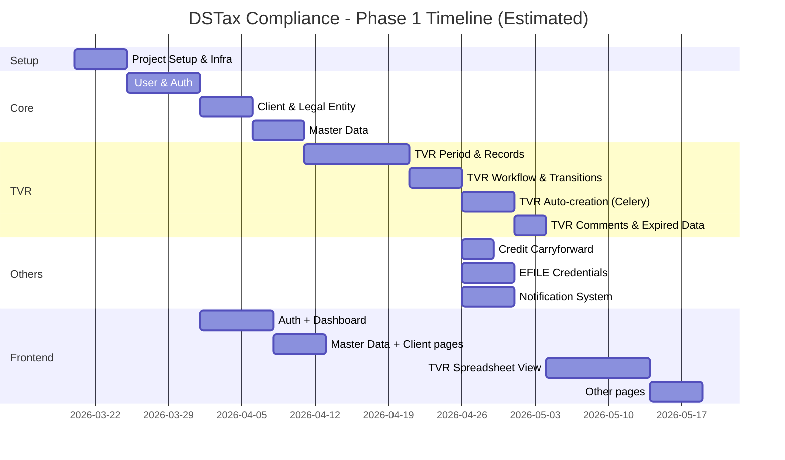

# DSTax Compliance - Task Plan & Roadmap

## Phase 1 - Core Features

### Epic 1: Project Setup & Infrastructure

- [ ] **1.1 Backend project setup**
  - Django project initialization
  - Install and configure DRF, JWT, Celery, Redis, PostgreSQL
  - Setup Docker / docker-compose for development
  - Setup CI/CD pipeline
  - Setup testing framework (pytest, factory_boy, faker)

- [ ] **1.2 Frontend project setup**
  - Next.js project initialization
  - Tailwind CSS setup (shared design tokens with DSTax Portal)
  - Setup API client (axios/fetch wrapper)
  - Setup auth context/provider

- [ ] **1.3 Common infrastructure**
  - Base model classes (with `created_at`, `updated_at`, `created_by`, `updated_by`)
  - Custom exception handling
  - Pagination configuration
  - API versioning strategy
  - Logging setup

---

### Epic 2: User & Authentication

- [ ] **2.1 User model design & implementation**
  - Custom User model (email-based)
  - Role model (DSTax Admin, DSTax Preparer, Client Admin, Client Staff)
  - User-Role assignment
  - User-Client assignment (for Client Admin/Staff)
  - User-LegalEntity assignment (for Preparer, Client Staff)

- [ ] **2.2 Authentication APIs**
  - POST `/api/auth/login/` → JWT token pair
  - POST `/api/auth/logout/` → Blacklist refresh token
  - POST `/api/auth/token/refresh/`
  - POST `/api/auth/forgot-password/`
  - POST `/api/auth/reset-password/`
  - POST `/api/auth/change-password/`
  - GET/PUT `/api/auth/profile/`

- [ ] **2.3 Permission system**
  - Custom DRF permissions for each role
  - Object-level permissions (DP only sees assigned LEs)
  - View/Edit separation

---

### Epic 3: Client & Legal Entity

- [ ] **3.1 Client CRUD**
  - Model, Serializer, ViewSet
  - GET `/api/clients/` (list + filter + search)
  - POST `/api/clients/`
  - GET `/api/clients/{id}/`
  - PUT/PATCH `/api/clients/{id}/`
  - DELETE `/api/clients/{id}/` (soft delete via `is_active`)

- [ ] **3.2 Legal Entity CRUD**
  - Model, Serializer, ViewSet
  - Nested under Client: `/api/clients/{id}/legal-entities/`
  - Or flat: `/api/legal-entities/?client={id}`
  - unique_together constraint (client, name)

---

### Epic 4: Master Data

- [ ] **4.1 JurisdictionLevel CRUD** → `/api/master/jurisdiction-levels/`
- [ ] **4.2 Jurisdiction CRUD** → `/api/master/jurisdictions/`
  - Include due_date_time handling
  - Filter by level
- [ ] **4.3 PrepaymentMethod CRUD** → `/api/master/prepayment-methods/`
  - OneToOne with Jurisdiction
- [ ] **4.4 FilingFrequency CRUD** → `/api/master/filing-frequencies/`
- [ ] **4.5 FilingType CRUD** → `/api/master/filing-types/`
- [ ] **4.6 TaxType CRUD** → `/api/master/tax-types/`

> [!NOTE]
> All Master Data CRUD permissions are restricted to DSTax Admin only. Other roles are READ-ONLY.

---

### Epic 5: TVR (Tax Valuation Report)

- [ ] **5.1 TVRPeriod model & API**
  - Model implementation with unique_together (client, period_month, period_year)
  - GET `/api/tvr-periods/` (filter by client, month, year, status)
  - GET `/api/tvr-periods/{id}/`
  - Auto-creation logic (Celery task)

- [ ] **5.2 TVRRecord model & API**
  - Model implementation (17+ decimal fields)
  - GET `/api/tvr-periods/{id}/records/` (list records of a period)
  - PUT/PATCH `/api/tvr-records/{id}/` (editable fields only)
  - Bulk update endpoint for performance

- [ ] **5.3 TVR Workflow status transitions**
  - POST `/api/tvr-periods/{id}/transition/` (body: `{status: "PREPARED"}`)
  - Validation: only allow valid transitions
  - Permission check: DP → PREPARED, DA → REVIEW_COMMENTS/PUBLISHED/FUNDING_RECEIVED

- [ ] **5.4 TVR Auto-creation Celery task**
  - Monthly scheduled task (1st of each month)
  - Create new TVRPeriod for each active Client
  - Expire previous month's TVRPeriod
  - Backup TVRRecord → CSV/Excel file → save in backup_file
  - Delete old TVRRecords (after verifying backup)

- [ ] **5.5 TVR Comments/Reviews**
  - DA can add reviews/comments
  - DP can view comments
  - Model: `TVRComment` or integration into TVRRecord (`client_comment`, `dstax_comment`)

- [ ] **5.6 TVR Expired data access**
  - `get_records()` logic: if expired → return backup file URL / parsed data
  - Read-only mode for expired periods

---

### Epic 6: Credit Carryforward

- [ ] **6.1 CreditCarryforward CRUD**
  - Model, Serializer, ViewSet
  - GET `/api/credit-carryforwards/` (filter by client, LE, jurisdiction)
  - POST/PUT/DELETE
  - unique_together constraint
  - Permissions restricted to DA and assigned DPs

---

### Epic 7: EFILE Credentials

- [ ] **7.1 EFileCredential model design**
  - Encryption for sensitive fields (password, pin, security questions)
  - Use django-encrypted-model-fields or similar

- [ ] **7.2 EFileCredential API**
  - GET `/api/efile-credentials/` (filter by client, LE)
  - POST/PUT/DELETE
  - DA sees all, DP only sees assigned clients

- [ ] **7.3 Data migration**
  - Import data from existing EFILE Credentials CSV into DB

---

### Epic 8: Notification System

- [ ] **8.1 Email service integration**
  - Django email backend (AWS SES or SMTP)
  - Email templates for various events
  - Celery task for async email sending

- [ ] **8.2 Teams notification integration**
  - Microsoft Teams webhook/bot integration
  - Celery task for async Teams message sending

- [ ] **8.3 Notification events**
  - PREPARED → Teams to DA
  - REVIEW_COMMENTS → Teams to DP
  - PUBLISH RETURNS → Teams to DA + Email to Client
  - FUNDING RECEIVED → Teams to DP

---

### Epic 9: Frontend - Phase 1

- [ ] **9.1 Auth pages**
  - Login, Forgot Password, Reset Password
  - Change Password (settings)
  - Profile page

- [ ] **9.2 Dashboard**
  - Statistical overview of Client/LE/TVR
  - Quick actions

- [ ] **9.3 Master Data management pages**
  - CRUD pages for each master data table
  - DSTax Admin only

- [ ] **9.4 Client & LE management pages**
  - Client list, detail, create/edit
  - LE list (nested under Client), create/edit

- [ ] **9.5 TVR pages**
  - Period list (filter by client, month, year)
  - TVR spreadsheet-like view (records as rows)
  - Inline editing for editable columns
  - Workflow buttons (PREPARED, REVIEW COMMENTS, etc.)
  - Comments view

- [ ] **9.6 EFILE Credentials page**
  - Table view with search/filter
  - Create/Edit modal
  - Masked password display

- [ ] **9.7 Credit Carryforward page**
  - Table view with filters
  - Create/Edit functionality

---

## Phase 2 - Extended Features

### Epic 10: Client Folders (Google Drive-like)

- [ ] **10.1 Folder/File model design**
- [ ] **10.2 File upload/download API (S3)**
- [ ] **10.3 Folder structure management**
- [ ] **10.4 Drag & drop UI**
- [ ] **10.5 Sub-sections**: Inbound Data, Outbound Data, Archived Returns, Client Documents
- [ ] **10.6 Notifications on file changes**

### Epic 11: Support Tickets

- [ ] **11.1 Ticket model & API**
- [ ] **11.2 Ticket UI**
- [ ] **11.3 Email notifications on ticket creation**

### Epic 12: Communications

- [ ] **12.1 Email compose/send to clients**
- [ ] **12.2 Outlook group integration**
- [ ] **12.3 Communication history**

---

## Priority Order (Suggested Order)

---

## Key Decisions Needed

| # | Decision | Impact | Notes |
|---|---|---|---|
| 1 | API nesting style (nested vs flat) | API design | E.g.: `/clients/{id}/legal-entities/` vs `/legal-entities/?client={id}` |
| 2 | TVR backup: soft-delete vs hard-delete? | Data safety | Recommend: soft-delete + archive table |
| 3 | Encryption library for EFILE Credentials | Security | django-encrypted-model-fields, django-fernet-fields... |
| 4 | Teams integration method | Notifications | Webhook vs Bot Framework |
| 5 | TVR UI: custom table vs library? | FE complexity | AG Grid, TanStack Table, or custom |
| 6 | `due_date_time` design in Jurisdiction | Master Data logic | Single DateTimeField or separate fields? |
| 7 | File storage for Client Folders (Phase 2) | Infrastructure | S3 direct upload vs presigned URLs |
